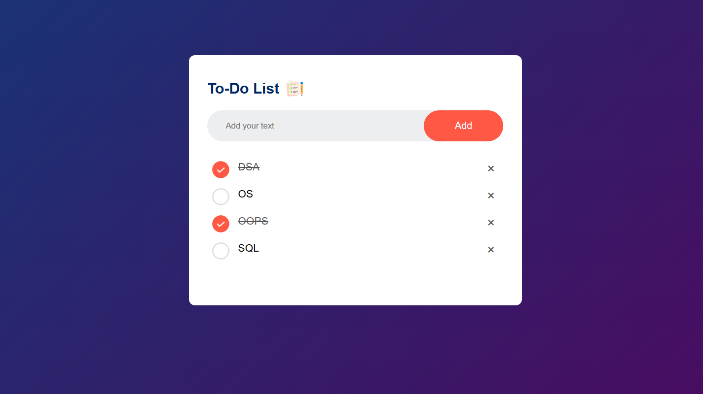

# To Do List
- This is a small component make using JavaScript, CSS, HTML.
- User can list the tasks and scratch the completed tasks and also can remove the tasks.

Preview

#### Learning
- Storing data at local storage using `localStorage()`, so that when page is refreshed the previous state is not lost.
- Creating a HTML elements using `createElement()` on click, when event occur. 

\#GreatStack \#Youtube